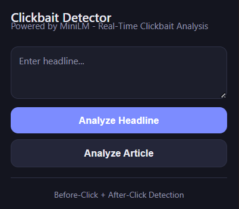
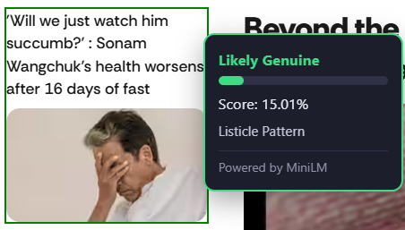
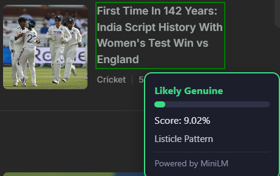
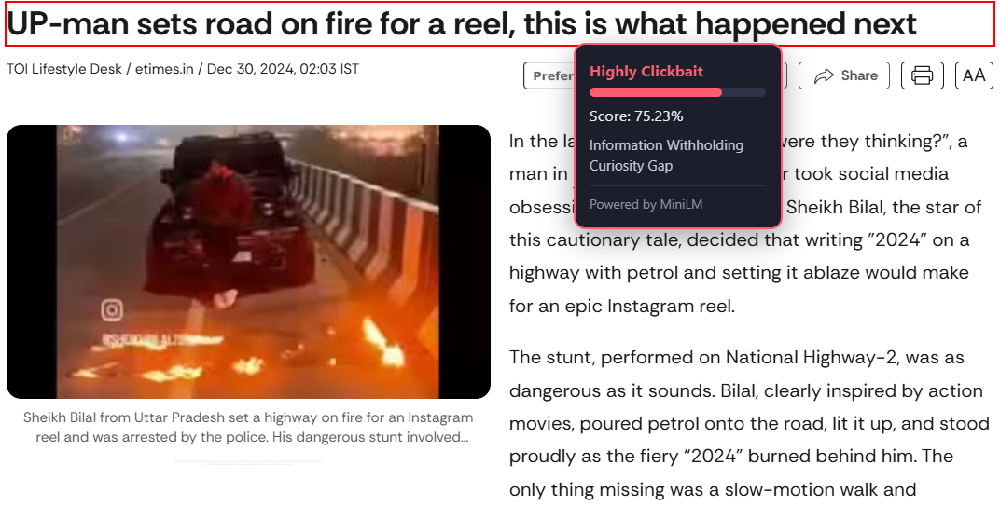
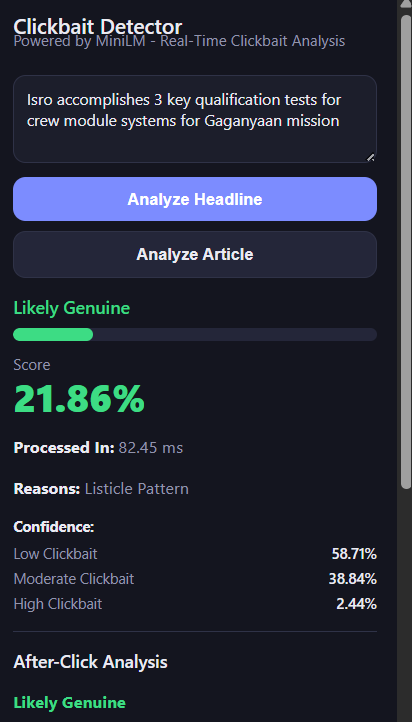
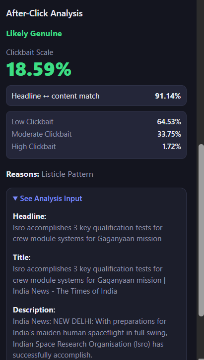

# Browser Extension for Explainable Clickbait Detection

## Overview

This project is an AI-powered browser extension that detects clickbait news headlines in real time. The system performs both **Before-Click Analysis** and **After-Click Analysis** to help users identify misleading, exaggerated, or low-quality news content while browsing the web — and, unlike a plain score, it explains *why* a headline was flagged.

The extension combines Natural Language Processing (NLP), fine-tuned transformer classifiers, an independent semantic-similarity check, and a two-tier explanation layer (rule-based + model-attribution fallback) to analyze headlines and article content and return a human-readable justification alongside every prediction.

---

# Structure 
<p align="center">
  
</p>

# Outcomes

## Hover-Based Detection

<p align="center">
  
  
  
</p>

## After-Click Analysis

<p align="center">
  
  
</p>

## Problem Statement

Clickbait headlines are designed to attract attention and encourage clicks by exploiting curiosity, exaggeration, or emotional triggers.

Examples:
* "You Won't Believe What Happened Next!"
* "This Simple Trick Changed His Life Forever!"
* "Doctors Hate This One Secret!"

Such headlines often fail to accurately represent the actual content of the article. This project detects such patterns automatically and gives users a clickbait risk score **plus a concrete reason**, in two separate moments — before they click, and after they've read the article.

---

## Key Features

### Before-Click Analysis

Analyzes a news headline before opening the article, using headline text alone.

Provides:
* Clickbait score (0–100%)
* Risk category (Likely Genuine / Possibly Clickbait / Highly Clickbait)
* Per-class confidence breakdown (Low / Moderate / High Clickbait)
* Explanation of the detected clickbait tactic(s)

### After-Click Analysis

Analyzes the headline together with the full article context:
* Headline
* Article title
* Meta description
* Article body (first few paragraphs)

Provides:
* Consistency score after reading the full article
* An **independent** headline ↔ content semantic-match percentage (cosine similarity, computed by a separate sentence-embedding model — not the classifier itself)
* Explanation, including an explicit "low semantic match" flag when the headline and article diverge in meaning

### Real-Time Browser Integration

The extension works directly inside Google Chrome (Manifest V3).

Features include:
* Automatic headline/article extraction with fallback selectors for varied site layouts
* Hover-based analysis tooltip with a 250ms debounce and client-side result caching
* Color-coded risk visualization (green / amber / red)
* Interactive popup interface for manual headline and full-article analysis

---

## Project Evolution

### Phase 1: Classical Machine Learning *(superseded)*

Initial implementation used:
* TF-IDF vectorization
* Logistic Regression classifier

Pipeline: `Headline → TF-IDF → Logistic Regression → Prediction`

This phase was fast and lightweight but relied heavily on surface-level keyword matching with limited semantic understanding, and was replaced once the transformer-based approach below was built.

### Phase 2: Transformer-Based Classification

The project was upgraded to two **separately fine-tuned** transformer sequence-classification models (MiniLM/DistilBERT-class), rather than a single general-purpose embedding model feeding a downstream classifier:

* **Before-click model** — fine-tuned on headline text alone (Dataset A)
* **After-click model** — fine-tuned on the concatenation of headline + title + description + article body (Dataset B)

Pipeline: `Text → Tokenizer → Fine-tuned transformer classifier → Softmax → Weighted 0–1 score`

Benefits over Phase 1:
* Contextual semantic understanding instead of keyword frequency
* Better generalization to unseen headline phrasing
* Native 3-class output (Low / Moderate / High Clickbait) rather than a single binary label

### Phase 3: Independent Semantic Similarity Signal

A separate, untrained `all-MiniLM-L12-H384 uncased` Sentence-Transformer was added specifically for the after-click path, to measure how closely the headline's *meaning* matches the article's content — independent of, and complementary to, the after-click classifier. This catches cases where wording overlaps but meaning diverges, or vice versa.

### Phase 4: Explainability Layer

The system no longer returns a bare score. A two-tier explanation pipeline was added:
1. **Rule-based tactic detection** (`explanation.py`) — regex-matches the input against a curated dictionary of six clickbait tactics (Curiosity Gap, Emotional Trigger, Information Withholding, Exaggeration, Fear Appeal, Advice/Warning Framing) plus a listicle detector.
2. **Model-based fallback** (`model_explanation.py`) — when the rule-based dictionary finds no match, Captum's **Integrated Gradients** is run against the model itself to surface the exact words that drove its prediction, so novel or unlisted clickbait patterns still get a meaningful explanation instead of "no indicators detected."

---

## Technologies Used

### Frontend

* HTML, CSS, JavaScript (ES6+)
* Chrome Extension API (Manifest V3)

### Backend

* Python 3
* FastAPI + Uvicorn
* Pydantic (request validation)

### Machine Learning

* PyTorch
* Hugging Face Transformers (`AutoConfig`, `AutoModelForSequenceClassification`, `PreTrainedTokenizerFast`)
* Sentence-Transformers (`all-MiniLM-L12-H384 uncased`) — semantic similarity only
* Captum (`LayerIntegratedGradients`) — model-attribution explanations

### Data Processing

* NumPy
* safetensors / pickle (model bundle serialization)

---

## Dataset

The project uses the Webis Clickbait Corpus 2017 (Clickbait Challenge Dataset).

Important fields:

### instances.jsonl

Contains:
* `postText`
* `targetTitle`
* `targetDescription`
* `targetParagraphs`

### truth.jsonl

Contains:
* `truthMean`
* `truthClass`

Example:
```
truthClass = clickbait
truthMean = 1.0
```

Two derived training sets were built from these fields:
* **Dataset A** (before-click): `postText → truthMean`
* **Dataset B** (after-click): `postText + targetTitle + targetDescription + first 3 targetParagraphs → truthMean`

---

## Model Architecture

### Before-Click Detection

Input: Headline only

Process:
1. Tokenize headline (`PreTrainedTokenizerFast`, max length 512)
2. Run through the fine-tuned before-click transformer classifier
3. Softmax → 3-class probabilities → weighted 0–1 score (Low=0.0, Moderate=0.5, High=1.0)
4. `build_reasons()`: rule-based tactic match, or Captum fallback if no match

Output:
* Clickbait score (%) and category
* Per-class confidence breakdown
* Reasons list
* Processing time (ms)

### After-Click Detection

Input: Headline + Page Title + Meta Description + Article Content

Process:
1. Extract headline, title, description, and body from the webpage
2. Concatenate all fields and run through the fine-tuned after-click transformer classifier
3. **Separately**, encode the headline and the article content (title+description+body) with the sentence-embedding model and compute cosine similarity
4. `build_reasons()` generates the explanation; a "low semantic match" reason is appended if similarity falls below 0.35

Output:
* Consistency score (%) and category
* Headline ↔ content semantic-match percentage
* Per-class confidence breakdown
* Reasons list
* Processing time (ms)

---

## Categories

The system classifies content into:

### Likely Genuine
Weighted score below 0.30.

### Possibly Clickbait
Weighted score between 0.30 and 0.70.

### Highly Clickbait
Weighted score of 0.70 or above.

---

## Explainable AI Features

The system provides two layers of explanation:

**Rule-based tactics** (fast, curated, checked first):
* Curiosity Gap
* Emotional Trigger
* Information Withholding
* Exaggeration
* Fear Appeal
* Advice / Warning Framing
* Listicle Pattern

**Model-based fallback** (Captum Integrated Gradients, used only when no rule-based tactic matches):
* Surfaces the top 5 words that most positively influenced the model's prediction, so headlines that trip the model on a pattern outside the fixed dictionary still get a concrete, human-readable reason.

---

## Browser Extension Workflow

1. User visits a news website.
2. The extension extracts the headline (on hover) or the full article context (via the popup), using prioritized selectors with generic fallbacks for unfamiliar page layouts.
3. The extracted text is relayed through the background service worker to the FastAPI backend.
4. FastAPI routes the request to `/predict_style` (before-click) or `/predict_consistency` (after-click).
5. The matching fine-tuned model runs inference; for after-click requests, the semantic-similarity check runs in parallel.
6. `build_reasons()` generates the explanation (rule-based, or Captum fallback).
7. Results — score, category, confidence breakdown, semantic match (after-click only), and reasons — are returned as JSON and rendered in the hover tooltip or popup, color-coded by risk.
8. The user may run After-Click Analysis from the popup for deeper, full-article inspection.

---

## API Endpoints

| Endpoint | Method | Input | Purpose |
|---|---|---|---|
| `/` | GET | — | Health check |
| `/predict_style` | POST | `headline` | Before-click style classification |
| `/predict_consistency` | POST | `headline`, `title`, `description`, `article_text` | After-click consistency + semantic similarity |

---

## Project Structure

```
backend/
├── app.py                     # FastAPI app, model loading, endpoints
├── explanation.py             # Rule-based clickbait tactic detection
├── model_explanation.py       # Captum Integrated Gradients fallback
├── requirements.txt
├── before_click_model.pkl     # Fine-tuned before-click model bundle
└── after_click_model.pkl      # Fine-tuned after-click model bundle

extension/
├── manifest.json
├── background.js              # Service worker: relays requests to the API
├── content.js                 # Hover detection, tooltip, debounce + cache
├── config.js                  # API_BASE_URL configuration
├── popup.html
├── popup.js
└── style.css
```

---

## Known Limitations

* Supports English-language headlines and articles only.
* The after-click model is trained on clickbait labels, not explicit headline-content consistency labels — it functions as a context-enriched clickbait classifier rather than a direct consistency/fact-checking detector.
* Semantic similarity captures topical relatedness, not factual contradiction or exaggeration.
* Extraction may fail on dynamically loaded pages, paywalled articles, or unusual HTML structures.
* Rule-based explanations improve interpretability but do not fully expose the transformer's internal decision process.

---

## Future Scope

* Regional/multilingual clickbait detection beyond English
* Coverage of social media platforms (Twitter/X, Facebook, Instagram, Reddit) beyond news sites
* Extension to video-platform titles and thumbnails
* User feedback mechanism for continuous model refinement
* Multimodal analysis of accompanying images/thumbnails (e.g. CLIP)
* Structured multi-field encoding (headline, title/description, and intro encoded separately)
* NLI-style consistency framing (entailment / neutral / contradiction)
* Model-based explainability via SHAP as an alternative to Integrated Gradients
 
